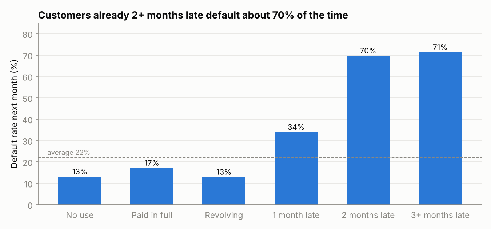
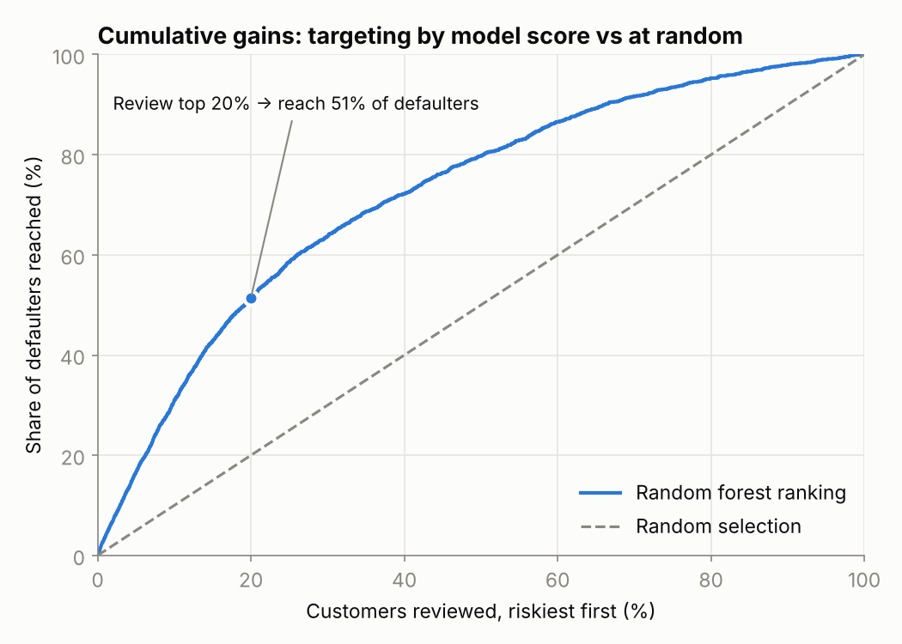

# Credit Card Default Prediction

Which credit card customers are likely to miss next month's payment? This project builds and compares classification models on 24,000 accounts from a Taiwanese bank, then turns the best model into a decision rule a credit team could act on.

**[View the notebook →](credit_default_prediction.ipynb)**

## Key results

| Model | Test accuracy | Recall | ROC-AUC |
|---|---:|---:|---:|
| Baseline (always "no default") | 77.9% | 0% | 0.500 |
| Logistic regression | 77.1% | 58.3% | 0.758 |
| Decision tree (unconstrained) | 72.1% | 41.5% | 0.612 |
| Decision tree (tuned, 5-fold CV) | 72.5% | 64.7% | 0.770 |
| **Random forest** | **78.1%** | **60.6%** | **0.786** |

- **Accuracy alone is misleading.** Only 22% of customers default, so a model that never predicts default is already 78% accurate while catching nobody. I compare models on recall and ROC-AUC instead.
- **The random forest ranks risk best.** If the bank reviews the **riskiest 20% of customers, it reaches 51% of next month's defaulters**, 2.5× better than picking at random.
- **Recent repayment behaviour is the strongest signal.** Customers already 2+ months late default about 70% of the time, compared with 22% overall.





## What the notebook covers

1. **Data quality checks.** Undocumented `EDUCATION` and `MARRIAGE` codes are found and recoded.
2. **Exploratory analysis.** Default rate by repayment status and by credit-limit band.
3. **Feature engineering.** Credit utilisation, payment ratio and the count of months late are added. `SEX` is excluded for fairness reasons.
4. **Modelling.** Five models are built in scikit-learn pipelines (no leakage), using a stratified 70/30 split and imbalance-aware class weights.
5. **Business translation.** A cumulative gains analysis shows how many defaulters the bank reaches for a given review effort.
6. **Explainability.** Permutation importance identifies the top drivers of risk.
7. **Recommendations and limitations.**

## Tools

Python · pandas · NumPy · scikit-learn · Matplotlib · Jupyter

## Run it

```bash
pip install -r requirements.txt
jupyter notebook credit_default_prediction.ipynb
```

## Data

The data is *Default of Credit Card Clients* by I-Cheng Yeh and Che-hui Lien, from the [UCI Machine Learning Repository](https://archive.ics.uci.edu/dataset/350/default+of+credit+card+clients), licensed under [CC BY 4.0](https://creativecommons.org/licenses/by/4.0/). This repo uses the 24,000-row version distributed by [PyCaret](https://github.com/pycaret/pycaret). The original dataset has 30,000 rows.

> Yeh, I. C., & Lien, C. H. (2009). The comparisons of data mining techniques for the predictive accuracy of probability of default of credit card clients. *Expert Systems with Applications*, 36(2), 2473–2480.

## About

This started as an assignment for my Master of Business Analytics at Macquarie University. I then extended it into this portfolio version with imbalance-aware evaluation, cross-validated tuning, a random forest, gains analysis and business recommendations.

**Shayor Hamid** · [LinkedIn](https://www.linkedin.com/in/shayorhamid/) · [GitHub](https://github.com/Shayor100)
